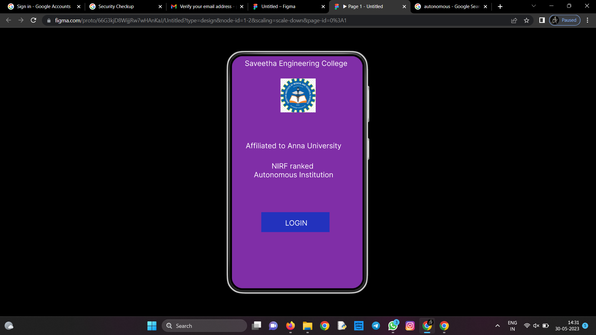
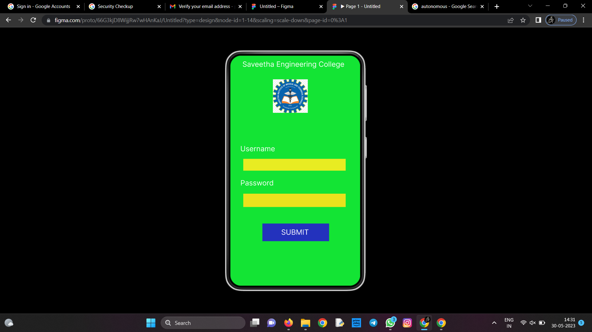
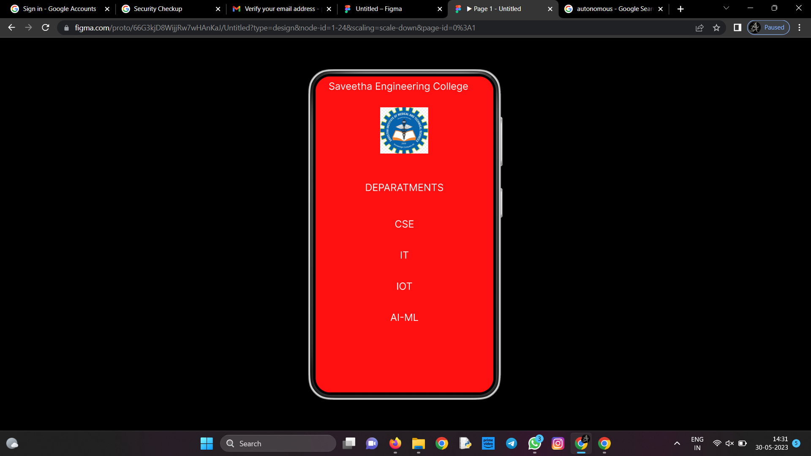

# Event Registration Web Application

## AIM:
To design, develop and deploy a web application for event registration.

## DESIGN STEPS:

### Step 1:
Create a new frame.

### Step 2:
Select any one present size on your choice.

### Step 3:
Select the shape you need.

### Step 4:
Import images as need.

### Step 5:
Create pages based on your need and link them.
### Step 6:

Validate the HTML and CSS code.

### Step 6:

Publish the website in the given URL.

## DESIGN:
Figma
## PROGRAM :
/* Saveetha Engineering College */

position: absolute;
width: 336px;
height: 49px;
left: 9px;
top: 8px;
font-family: 'Inter';
font-style: normal;
font-weight: 400;
font-size: 20px;
line-height: 24px;
text-align: center;
color: #FFFFFF;

/* Affiliated to Anna University */

position: absolute;
width: 336px;
height: 49px;
left: 2px;
top: 235px;
font-family: 'Inter';
font-style: normal;
font-weight: 400;
font-size: 20px;
line-height: 24px;
text-align: center;
color: #FFFFFF;

/* NIRF ranked Autonomous Institution */

position: absolute;
width: 336px;
height: 49px;
left: 2px;
top: 291px;
font-family: 'Inter';
font-style: normal;
font-weight: 400;
font-size: 20px;
line-height: 24px;
text-align: center;
color: #FFFFFF;

/* logo 1 */

position: absolute;
width: 97px;
height: 93px;
left: 134px;
top: 62px;
background: url(logo.png), url(logo.png), url(logo.png);

/* Rectangle 1 */

position: absolute;
width: 188px;
height: 55px;
left: 81px;
top: 430px;
background: #2332BD;

/* LOGIN */

position: absolute;
width: 165px;
height: 37px;
left: 95px;
top: 448px;
font-family: 'Inter';
font-style: normal;
font-weight: 400;
font-size: 20px;
line-height: 24px;
text-align: center;
color: #FFFFFF;

/* Saveetha Engineering College */

position: absolute;
width: 336px;
height: 49px;
left: 7px;
top: 12px;
font-family: 'Inter';
font-style: normal;
font-weight: 400;
font-size: 20px;
line-height: 24px;
text-align: center;
color: #FFFFFF;

/* Username */

position: absolute;
width: 336px;
height: 49px;
left: -6px;
top: 247px;
font-family: 'Inter';
font-style: normal;
font-weight: 400;
font-size: 20px;
line-height: 24px;
color: #FFFFFF;

/* Password */

position: absolute;
width: 336px;
height: 49px;
left: 0px;
top: 342px;
font-family: 'Inter';
font-style: normal;
font-weight: 400;
font-size: 20px;
line-height: 24px;
color: #FFFFFF;

/* logo 2 */

position: absolute;
width: 97px;
height: 93px;
left: 118px;
top: 66px;
background: url(logo.png), url(logo.png), url(logo.png);

/* Rectangle 2 */

position: absolute;
width: 284px;
height: 33px;
left: 36px;
top: 287px;
background: #E8EC22;

/* Rectangle 3 */

position: absolute;
width: 284px;
height: 37px;
left: 36px;
top: 384px;
background: #EAE21D;

/* Rectangle 2 */

position: absolute;
width: 185px;
height: 49px;
left: 89px;
top: 467px;
background: #2332BD;

/* SUBMIT */

position: absolute;
width: 165px;
height: 37px;
left: 97px;
top: 479px;
font-family: 'Inter';
font-style: normal;
font-weight: 400;
font-size: 20px;
line-height: 24px;
text-align: center;
color: #FFFFFF;

/* Saveetha Engineering College */

position: absolute;
width: 336px;
height: 40px;
left: 0px;
top: 8px;
font-family: 'Inter';
font-style: normal;
font-weight: 400;
font-size: 20px;
line-height: 24px;
text-align: center;

color: #FFFFFF;

/* DEPARATMENTS */

position: absolute;
width: 336px;
height: 40px;
left: 12px;
top: 213px;
font-family: 'Inter';
font-style: normal;
font-weight: 400;
font-size: 20px;
line-height: 24px;
text-align: center;
color: #FFFFFF;

/* CSE */

position: absolute;
width: 336px;
height: 40px;
left: 12px;
top: 287px;
font-family: 'Inter';
font-style: normal;
font-weight: 400;
font-size: 20px;
line-height: 24px;
text-align: center;
color: #FFFFFF;

/* IT */

position: absolute;
width: 336px;
height: 40px;
left: 12px;
top: 350px;
font-family: 'Inter';
font-style: normal;
font-weight: 400;
font-size: 20px;
line-height: 24px;
text-align: center;
color: #FFFFFF;

/* IOT */

position: absolute;
width: 336px;
height: 40px;
left: 12px;
top: 413px;
font-family: 'Inter';
font-style: normal;
font-weight: 400;
font-size: 20px;
line-height: 24px;
text-align: center;
color: #FFFFFF;

/* IOT */

position: absolute;
width: 336px;
height: 40px;
left: 12px;
top: 413px;
font-family: 'Inter';
font-style: normal;
font-weight: 400;
font-size: 20px;
line-height: 24px;
text-align: center;
color: #FFFFFF;

/* AI-ML */

position: absolute;
width: 336px;
height: 40px;
left: 12px;
top: 476px;
font-family: 'Inter';
font-style: normal;
font-weight: 400;
font-size: 20px;
line-height: 24px;
text-align: center;
color: #FFFFFF;

/* logo 3 */

position: absolute;
width: 97px;
height: 93px;
left: 131px;
top: 63px;
background: url(logo.png), url(logo.png), url(logo.png);

## OUTPUT:

## Result:
The program to design,develop and deploy a web application for event registration is completed successfully.